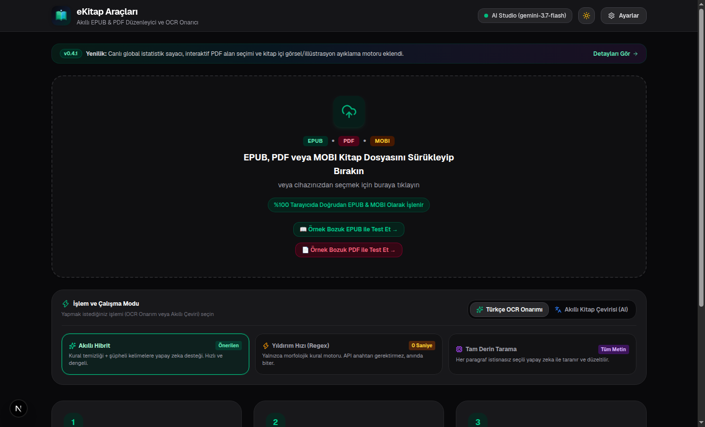
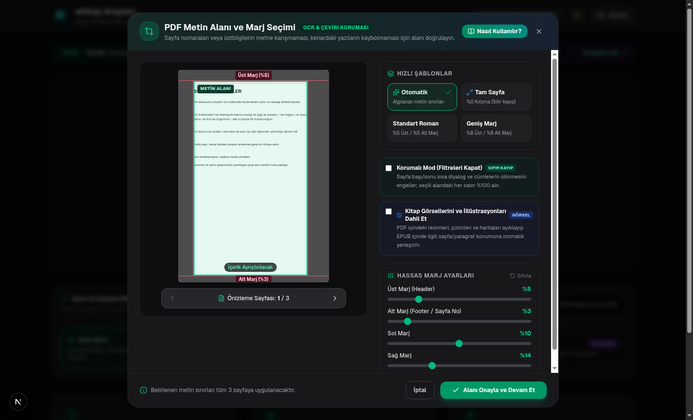
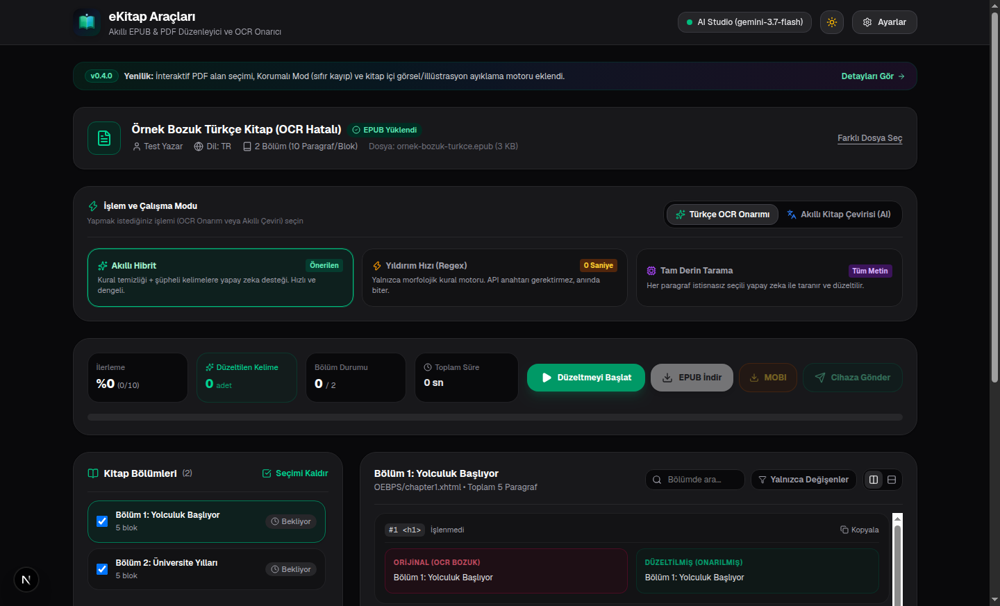
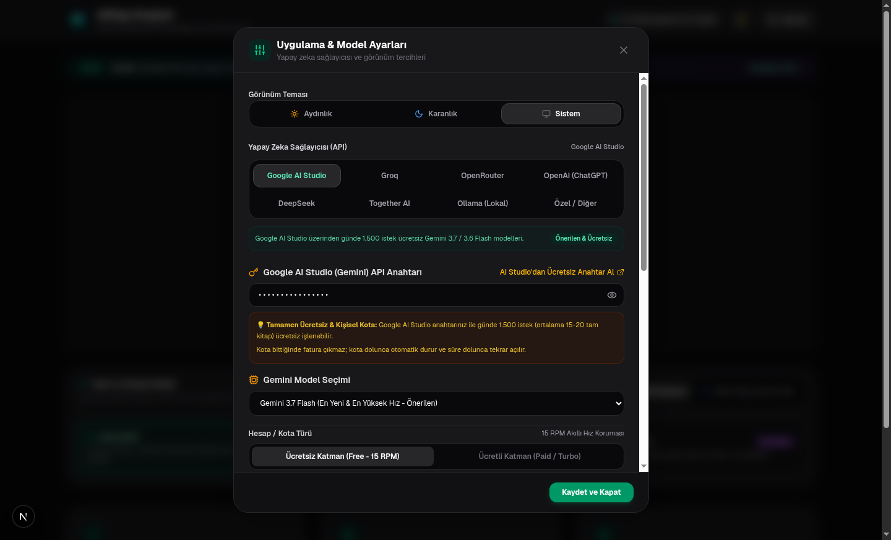

<div align="center">

# 📚 eKitap Araçları (eBook Tools)

**EPUB & PDF Düzenleyici, OCR Onarıcı ve Format Dönüştürücü**

Tarayıcı üzerinde çalışan, gizlilik odaklı, Türkçe dilbilgisi ve yapay zeka destekli e-kitap araç seti.

[](https://nextjs.org/)
[](CHANGELOG.md)
[](LICENSE)
[](scripts/verify-fixes.mjs)

[Özellikler](#-özellikler) • [Ekran Görüntüleri](#-ekran-görüntüleri) • [Ücretsiz API Key Rehberi](#-ücretsiz-yapay-zekâ-api-key-nasıl-alınır) • [Cihaza Gönder Rehberi](#-cihaza-gönder-rehberi-kindle--koreader) • [Çalışma Modları](#-işleme-ve-hız-modları) • [Docker & Kurulum](#-hızlı-başlangıç) • [Değişiklikler](CHANGELOG.md) • [Lisans](#-lisans)

</div>

---

## 📌 Neden eKitap Araçları?

PDF formatındaki kitapları EPUB'a çevirirken veya taranmış (OCR) e-kitapları okurken sıkça karşılaşılan:
- **Karakter Birleşmeleri**: `rn → m` (*yarm → yarın*, *kamı → karnı*, *öğmeci → öğrenci*), `cl → d`, `vv → w`
- **Satır Sonu Bölünmeleri**: `yapı- lamaz → yapılamaz`, `baş- ladı → başladı`, `geliş- tirme → geliştirme`
- **Parantez İçi ve Ara Söz Tireleri**: Ara sözlerdeki (`- ... -` veya `— ... —`) ve diyalog tirelerinin yanlışlıkla silinmesi
- **Bölük Pörçük Başlıklar**: Normal metinlerin başlık sanılması, gerçek bölüm başlıklarının kaybolması
- **Sunucu Yükleme Limitleri**: Vercel veya sunucu taraflı payload sınırları ve zaman aşımı sorunları

**eKitap Araçları**, tüm bu sorunları **%100 istemci tarafında (tarayıcıda)** çözen açık kaynaklı bir web uygulamasıdır. Kitap dosyanız hiçbir sunucuya yüklenmez.

---

## 🚀 Özellikler

### 1. 📖 İstemci Taraflı PDF & MOBI ➔ EPUB / MOBI Dönüştürücü
- `pdfjs-dist` ve yerel PalmDOC/MOBI motoruyla doğrudan tarayıcınızda çalışır.
- EPUB, PDF ve **MOBI** formatındaki kitapları açabilir, onarabilir ve hem **EPUB** hem de eski Kindle cihazları için **MOBI** olarak dışa aktarabilir.
- **📐 İnteraktif Görsel PDF Alan Seçimi & Korumalı Mod (`PdfCropModal`):**
  - PDF yüklendiğinde kitabın ortalarından en zengin metin sayfasını otomatik tespit edip tuvalde önizler.
  - Üstbilgi, altbilgi ve sayfa numaralarını kesmek için yeşil sınır kutusu ve kaydırıcılarla manuel alan seçimi sunar.
  - **Korumalı Mod:** Sayfa başı/sonundaki kısa diyalogların silinmesini engeller; seçili bölgedeki her satırı doğrudan alır.
- **🖼️ PDF Kitap Görselleri & İllüstrasyon Ayıklama Motoru:**
  - PDF içindeki resimleri, çizimleri ve haritaları ayıklayıp EPUB içinde ait olduğu sayfa/paragraf sırasına `<figure>` olarak yerleştirir.
  - Saydam PNG ve çizimler için beyaz zemin harmanlaması (`Alpha Blending`), RGBX sahte alfa onarımı ve CMYK renk uzayı desteğiyle resimlerin siyah veya beyaz çıkmasını engeller.
- **📌 İnteraktif Açılır Pencere (Popup Footnote) ve EPUB 3 Dipnot Standardı:**
  - PDF'lerdeki dipnot numaralarını (`¹`, `²`, `[1]`) ve sayfa altı dipnot tanımlarını otomatik tespit eder.
  - Sayfa bazlı etiketleme ve deterministik sıralama ile EPUB 3 `epub:type="noteref"` ve `<aside epub:type="footnote">` standartlarında popup kartlara dönüştürür.
  - Apple Books, KOReader, Kindle ve Kobo okuyucularda tıklanınca yerinde açılan interaktif dipnot deneyimi sunar.
- Fiziksel glif mesafesi (gap analysis) ile harf aralıklarını korur, kelime içi gereksiz boşlukları engeller.
- Sayfalar arası bölünmüş cümleleri (`söz` + `veriyorum."` ➔ `söz veriyorum."`) ve sayfa alt/üst lekelerini otomatik birleştirir.
- İçindekiler tablosunu (*TOC*) tek parça halinde korur ve kitap bölümlerini yapılandırır.

### 2. 📚 74.000+ Kelimelik TDK Sözlüğü & Morfolojik OCR Motoru
- `sozluk.gov.tr` resmi veri tabanından derlenen 74.000+ kelimelik çevrimdışı Türkçe sözlük ile çalışır.
- Dinamik ek çözücü (*Suffix Peeler*) ve ünsüz yumuşaması motoru ile ayrık harfleri (`k i t a p` ➔ `kitap`, `T ar i h i` ➔ `Tarihi`, `g e l i y o r d u` ➔ `geliyordu`) anında onarır.
- Çift yönlü harf bağlama ile `İyi ş anslar` ➔ `İyi şanslar` ve `dedi k aynı` ➔ `dedik aynı` hatalarını çözer.
- Bağımsız geçerli kelimeleri (`en iyi`, `hep iyi`, `tek işi`, `o gün`, `Onu mu`) koruyarak hatalı birleşmeleri (false positive) engeller.
- Unicode değiştirme karakterlerini (`\uFFFD` / ) ve bozuk noktalama işaretlerini (`.,,`) temizler.

### 3. 🌐 Bağlamsal Yapay Zekâ Kitap Çeviri Motoru
- 14 kaynak dilden 12 hedef dile (Türkçe, İngilizce, Almanca, Fransızca, İspanyolca vb.) kitap çevirisi.
- **Edebi & Akıcı Roman, Akademik ve Günlük Dil** üslup seçenekleri.
- **Kayan Bağlam Belleği (Rolling Memory):** Önceki paragrafların çevirisini hafızada tutarak karakter ses tonunu, hitap şekillerini ve zamir tutarlılığını korur.
- **Özel Karakter & Terim Sözlüğü (Glossary):** Kitaba özel terimlerin ve karakter isimlerinin kitap boyunca tutarlı çevrilmesini sağlar.

### 4. 🧠 Çoklu Yapay Zeka (LLM) Sağlayıcı Desteği
- **Google AI Studio (Gemini 3.7 Flash / 3.6 Flash)**: Doğrudan resmi Gemini API anahtarı (`AIzaSy...`) ile bağlantı. Günde **1.500 istek / gün** ücretsiz kullanım kotası sunar.
- **OpenAI Uyumlu API (Özel)**: OpenAI (GPT-4o / mini), DeepSeek (deepseek-chat), Groq (Llama 3.3 70B), Ollama (Lokal) ve herhangi bir özel LLM uç noktası desteği.
- **OpenRouter Free Modeller**: Llama 3.3 70B, Qwen 2.5 72B ve Mistral modelleriyle kullanım.

### 5. ⚡ 2 Aşamalı Hız ve İşleme Mimarisi (2-Phase Pipeline)
Ana sayfadan seçilebilen 3 farklı çalışma modu:
- ⚡ **Akıllı Hibrit (Önerilen)**:
  - *1. Aşama:* Tüm kitap Regex & TDK motorundan geçer, büyük bölümü anında temizlenir.
  - *2. Aşama:* Regex'in çözemediği bozulmalar genel havuzda toplanıp 10k-12k karakterlik paketlerle paralel AI modeline gönderilir.
- 🚀 **Yıldırım Hızı (Regex)**: API anahtarı gerektirmeden anında tamamlanır.
- 🧠 **Tam Derin Tarama**: Tüm paragrafları seçili yapay zeka modeliyle inceler.

### 6. 📱 Cihaza Gönder (Send-to-Kindle & KOReader Wi-Fi)
- **Send to Kindle**: `@kindle.com` adresinize Gmail/SMTP veya Resend ile doğrudan e-posta gönderimi.
- **KOReader Wi-Fi Aktarımı**: Yerel ağ üzerinden KOReader yüklü e-okuyucunuza (Kindle, Kobo, PocketBook, reMarkable) kablosuz dosya yükleme.
- **QR Kod & Yerel İndirme**: E-okuyucunun web tarayıcısından tek tıkla indirme imkanı.

### 7. 💾 Kalıcı IndexedDB Önbelleği
- İşlem durdurulduğunda veya sayfa yenilendiğinde tamamlanan paragraflar tarayıcı IndexedDB deposunda saklanır.
- Aynı kitap tekrar işlendiğinde daha önce taranan bloklar için tekrar istek yapılmaz.

### 8. 🛠️ Geliştirici (Developer) Modu
- Ayarlardan açılıp kapatılabilen sade / gelişmiş görünüm.
- Canlı regex ve LLM değişiklik günlüğü (*Diff Console*), JSON dışa aktarma.
- Özel Sistem Talimatı (*System Prompt*) düzenleyici, eşzamanlılık (*concurrency*) ve paket boyutu ayarı.

### 9. 🌓 Tema Desteği
- Karanlık ve aydınlık tema desteği.

---

## 🖼️ Ekran Görüntüleri

| 🎛️ Ana İşlem & Yükleme Paneli | 📐 İnteraktif PDF Alan Seçimi |
| :---: | :---: |
|  |  |
| **🔍 Canlı Karşılaştırma & Diff Önizleme** | **⚙️ Birleşik Yapay Zekâ Sağlayıcıları** |
|  |  |

---

## 🔑 Ücretsiz Yapay Zekâ API Key Nasıl Alınır?

Yapay zekâ destekli OCR onarımı ve kitap çevirisi için ücretsiz API anahtarı kullanabilirsiniz:

### 🌟 Seçenek 1: Google AI Studio (Önerilen)
Google, **Gemini 3.7 Flash** ve **Gemini 3.6 Flash** modellerini bireysel kullanım için **günde 1.500 istek (yaklaşık 15-20 tam kitap çevirisi)** ücretsiz olarak sunar.

1. **[aistudio.google.com/app/apikey](https://aistudio.google.com/app/apikey)** adresine gidin.
2. Google (Gmail) hesabınızla giriş yapın.
3. **"Create API key"** (API Anahtarı Oluştur) butonuna tıklayın.
4. Çıkan listeden bir proje seçin veya *"Create API key in new project"* deyin.
5. Oluşturulan `AIzaSy...` ile başlayan anahtarınızı kopyalayın.
6. **eKitap Araçları** sitesinde sağ üstteki **⚙️ Ayarlar** panelini açın.
7. **Google AI Studio** sekmesine yapıştırın ve **Kaydet** butonuna basın.

> **💡 Not:** Günlük limit dolduğunda fatura kesilmez; sistem `429 (Kota Doldu)` bildirimi verir ve süre dolunca kotanız otomatik yenilenir.

---

### 🌐 Seçenek 2: OpenRouter (Llama 3.3 70B vb.)
Açık kaynaklı modelleri kullanmak için:

1. **[openrouter.ai](https://openrouter.ai/)** adresine gidin ve hesap açın.
2. **Keys** sekmesinden **"Create Key"** butonuna basarak yeni bir anahtar oluşturun.
3. eKitap Araçları **Ayarlar > OpenRouter** sekmesine anahtarınızı yapıştırın.
4. Model olarak `:free` uzantılı ücretsiz modelleri (örneğin `meta-llama/llama-3.3-70b-instruct:free`) seçin.

---

### ⚡ Seçenek 3: Groq / OpenAI / DeepSeek / Ollama (Özel & Hızlı API)
Alternatif sağlayıcılar veya yerel model kullanmak için:

1. **Groq (Hızlı & Ücretsiz):** [console.groq.com/keys](https://console.groq.com/keys) üzerinden ücretsiz API key alın.
2. eKitap Araçları **Ayarlar > OpenAI / Özel** sekmesine gidin.
3. Üstteki hızlı şablonlardan **Groq**'a tıklayın. Model otomatik olarak `Llama 3.3 70B Versatile` seçilecektir.
4. Anahtarınızı yapıştırıp **Kaydet** butonuna basın. (Ayrıca DeepSeek, OpenAI veya yerel Ollama sunucusu da seçilebilir).

---

## 📱 Cihaza Gönder Rehberi (Kindle & KOReader)

### A. Send to Kindle (E-Posta ile Gönderim)
1. **Amazon Onaylı Liste Ayarı (Tek Seferlik):**
   - Amazon web sitesinde **İçerik ve Cihazlar (Manage Your Content and Devices) > Tercihler (Preferences) > Kişisel Belge Ayarları (Personal Document Settings)** sayfasına gidin.
   - **Onaylı Kişisel Belge E-posta Listesi (Approved Personal Document E-mail List)** alanına göndereceğiniz e-posta adresinizi (örnek: Gmail adresiniz) ekleyin.
2. **Uygulamadan Gönderme:**
   - Kitap onarımı tamamlandıktan sonra **Cihaza Gönder** butonuna tıklayın.
   - Kindle e-posta adresinizi (`adiniz@kindle.com`) ve Gmail Uygulama Şifrenizi (*App Password*) girin.
   - **Kindle'a Gönder** butonuna basın. Birkaç dakika içinde kitabınız kablosuz olarak Kindle'ınızda görünecektir.

### B. KOReader (Wi-Fi ile Doğrudan Aktarım)
1. E-Okuyucunuzda (Kindle, Kobo, reMarkable vb.) KOReader uygulamasını açın.
2. **Üst Menü > Ağ > Wi-Fi Dosya Aktarımı (Web Server)** seçeneğini başlatın.
3. Ekranda görüntülenen yerel IP adresini (örn: `http://192.168.1.50:8080`) uygulamadaki KOReader kutusuna girin.
4. **KOReader'a Aktar** butonuna tıklayın. Dosya doğrudan cihaz hafızasına yüklenecektir.

---

## 🛠️ Hızlı Başlangıç

### Gereksinimler
- **Node.js**: v18.18+ veya v20+
- **npm**, **pnpm**, **yarn** veya **bun**

### 1. Repoyu Klonlayın
```bash
git clone https://github.com/halilozdgn/ekitap-araclari.git
cd ekitap-araclari
```

### 2. Bağımlılıkları Yükleyin
```bash
npm install
```

### 3. Geliştirme Sunucusunu Başlatın
```bash
npm run dev
```
Tarayıcınızda [http://localhost:3000](http://localhost:3000) adresini açın.

### 4. Testleri Çalıştırın
```bash
npm test
```

### 5. Üretim Derlemesi (Build)
```bash
npm run build
npm start
```

---

## 🐳 Docker ile Çalıştırma (Self-Host & Homelab)

Node.js ortamı kurmadan doğrudan Docker veya Docker Compose ile tek komutla ayağa kaldırabilirsiniz:

### Seçenek A: Docker Compose ile (Önerilen)
```bash
# Arka planda başlatın
docker compose up -d

# Logları takip edin
docker compose logs -f
```

### Seçenek B: Docker CLI ile
```bash
# İmajı derleyin
docker build -t ekitap-araclari .

# Konteyneri başlatın
docker run -d -p 3000:3000 --name ekitap-araclari --restart unless-stopped ekitap-araclari
```

Konteyner başladıktan sonra tarayıcınızdan `http://localhost:3000` (veya ev sunucunuzun yerel IP'si: `http://192.168.x.x:3000`) adresine erişebilirsiniz.

---

## 🏗️ Teknik Mimari

```
src/
├── app/
│   ├── api/
│   │   ├── antigravity/      # Google OAuth proxy ve chat endpoints
│   │   ├── auth/google/      # Google OAuth PKCE token exchange
│   │   ├── kindle/send/      # Send to Kindle SMTP & Resend API
│   │   └── koreader/upload/  # KOReader Wi-Fi yükleme proxy
│   ├── globals.css           # Tailwind CSS v4 & theme variables
│   ├── layout.tsx            # Metadata, fonts & theme flash prevention
│   └── page.tsx              # Ana sayfa ve işleme paneli
├── components/
│   ├── ChapterList.tsx       # Kitap bölümleri ve durum göstergesi
│   ├── DebugConsole.tsx      # Geliştirici değişiklik günlüğü çekmecesi
│   ├── DiffViewer.tsx        # Yan yana ve satır içi canlı diff önizleme
│   ├── Header.tsx            # Logo, marka, tema değiştirici ve durum
│   ├── SendToDeviceModal.tsx # Kindle & KOReader cihaz aktarım modalı
│   ├── SettingsModal.tsx     # Sağlayıcı, API key, önbellek & dev ayarları
│   ├── StatsBar.tsx          # İlerleme çubuğu, sayaçlar ve indirme
│   └── UploadSection.tsx     # EPUB & PDF sürükle-bırak yükleme alanı
└── lib/
    ├── antigravity.ts        # Google OAuth PKCE ve model tanımları
    ├── cache.ts              # IndexedDB kalıcı blok önbellek motoru
    ├── epub-engine.ts        # EPUB ayrıştırma, DOM onarımı & JSZip paketleme
    ├── mobi-engine.ts        # PalmDOC/MOBI ayrıştırma ve format dönüştürücü
    ├── openrouter.ts         # OpenRouter client ve edebi çeviri motoru
    ├── pdf-engine.ts         # Client-side PDF-to-EPUB ayrıştırma ve reflow motoru
    ├── processor.ts          # 2 Aşamalı boru hattı, AI batching ve LLM yöneticisi
    ├── tdk-dictionary.ts     # 74k TDK sözlüğü, Suffix Peeler ve dinamik birleştirici
    ├── turkish-ocr-rules.ts  # Türkçe morfoloji regex, çift yönlü bağlama kuralları
    └── types.ts              # TypeScript arayüz ve tip tanımları
```

---

## 🧪 Test Kapsamı

Projede yer alan **47 adet** Türkçe morfoloji, dinamik kelime birleştirme ve çeviri birim testi:
- Ara söz tirelerinin korunması (`- ... -`) ve diyalog çizgileri
- Ayrık harf ve hece birleştirmeleri (`k i t a p` ➔ `kitap`, `T ar i h i` ➔ `Tarihi`)
- Çift yönlü harf bağlama (`dedi k aynı` ➔ `dedik aynı`, `İyi ş anslar` ➔ `İyi şanslar`)
- Bağımsız kelime ve soru eki koruması (`en iyi`, `Onu mu`, `tek işi`)
- Sayfalar arası bölünmüş cümlelerin birleştirilmesi
- TDK morfolojik çekim çözücü (*Suffix Peeler*) doğrulamaları
- Edebi AI çeviri promptu ve bağlam koruma testleri
- Dayanıklı AI paket ayrıştırıcı (*Batch Parser Resilience*) testleri

Testleri çalıştırmak için:
```bash
npm test
```

---

## 🤝 Katkıda Bulunma

Katkılarınızı memnuniyetle kabul ediyoruz!

1. Bu depoyu Fork edin (`fork`)
2. Yeni bir özellik dalı oluşturun (`git checkout -b feat/harika-ozellik`)
3. Değişikliklerinizi commit edin (`git commit -m 'feat: harika ozellik eklendi'`)
4. Dalınıza push edin (`git push origin feat/harika-ozellik`)
5. Bir **Pull Request** açın

---

## 📄 Lisans

Bu proje [MIT Lisansı](LICENSE) altında lisanslanmıştır. Dilediğiniz gibi kullanabilir, değiştirebilir ve dağıtabilirsiniz.

---

<div align="center">
Geliştirici: <b>Halil Özdoğan</b> • <a href="https://github.com/halilozdgn">GitHub Profili</a>
</div>
